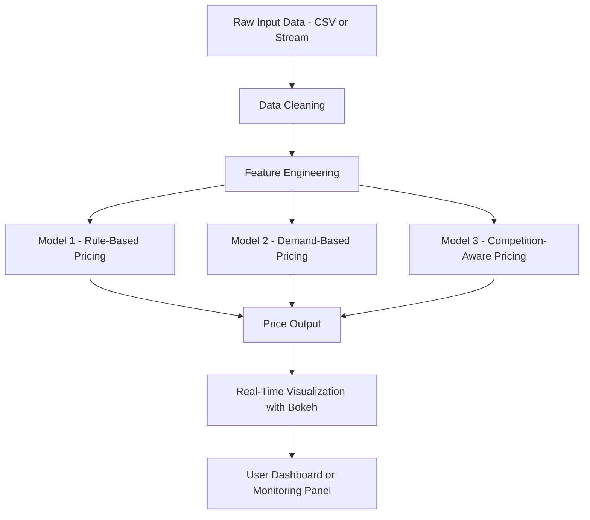

# capstoneproject

[Dynamic Pricing for Urban Parking Lots](./Dynamic Pricing for Urban Parking Lots.pdf)

## 🔧 Tech Stack

| Category               | Tools / Libraries Used                                                                 |
|------------------------|----------------------------------------------------------------------------------------|
| **Programming Language** | Python 3                                                                              |
| **Data Manipulation**     | NumPy, Pandas                                                                        |
| **Visualization**         | Bokeh (interactive plots), Matplotlib, Panel (layout), IPython.display              |
| **Streaming & Pipelines** | Pathway (real-time data streaming and transformation)                                |
| **Geospatial Analysis**   | scikit-learn (BallTree for proximity), geopy (if used elsewhere for coordinates)     |
| **Notebook Environment**  | Google Colab (development and execution)                                             |
| **Version Control**       | Git, GitHub                                                                          |
| **Miscellaneous**         | `time.sleep`, `random`, `datetime` (for simulation and time-based operations)        |

## 🏗️ Architecture Diagram

Project Architecture & Workflow
This project simulates a real-time dynamic pricing system for 14 urban parking lots using a combination of economic logic, data engineering, and visualization techniques. Below is a breakdown of the architectural components and the workflow followed.

1. 🔹 Data Ingestion
Raw data is initially loaded from a .csv file or simulated as a real-time stream.

Each row contains timestamped records with information like:

Occupancy

Queue Length

Traffic Level

Competitor Prices

Special Day Indicator

Vehicle Type Weights

The data was preprocessed and streamed using Pathway, enabling real-time simulation and transformations.

2. 🧹 Data Cleaning & Preprocessing
Missing values in time-series columns (like occupancy, queue length, etc.) were handled using interpolation.

A new column t was created to convert and sort the timestamps in datetime format.

Feature consistency across time steps was ensured.

3. 🧠 Feature Engineering
To enhance the model's spatial awareness:

Proximity Features were added using geospatial techniques:

distance_to_nearest_parking

num_parkings_within_500m

BallTree from sklearn.neighbors was used for efficient distance calculations.

4. 🤖 Pricing Models
Three distinct pricing strategies were implemented:

⚙️ Model 1: Rule-Based Pricing
Based on if-else rules using thresholds on:

Occupancy

Queue Length

Traffic Congestion

Special Day flags

📈 Model 2: Demand-Based Pricing
Based on a demand function:

Demand
=
𝛼
−
𝛽
⋅
Price
+
𝛾
⋅
(
Occupancy
+
Traffic
)
Demand=α−β⋅Price+γ⋅(Occupancy+Traffic)
Prices are optimized using a linear function to balance demand and maximize utility.

📊 Model 3: Competition-Aware Pricing
Builds upon Model 2 by including:

Competitor prices from nearby parking lots

Adjustments based on the difference between competitor and base prices

5. 🔄 Real-Time Simulation
Pathway was used to simulate streaming data by iterating over the DataFrame row-by-row with delay (sleep()).

Each new data point triggered the pricing logic dynamically and stored the result.

6. 📊 Visualization & Monitoring
Real-time plots were generated using Bokeh:

Dynamic line charts of price, adjusted price, and competitor price over time.

Interactive controls (Checkboxes, Layouts) were created using Panel and Bokeh layouts.

Data was visualized in Google Colab with output_notebook().

7. 💡 Deployment Consideration
While this was built and tested in Colab, the architecture is scalable and could be extended to:

Real-world APIs for traffic/occupancy input

Deployed dashboards via Bokeh Server or Streamlit

Integration with smart parking meters for live pricing

## Final Report

You can view the complete project report here:

[👉 Click to view the Report (PDF)](./docs/Dynamic Pricing for Urban Parking Lots.pdf)

 
