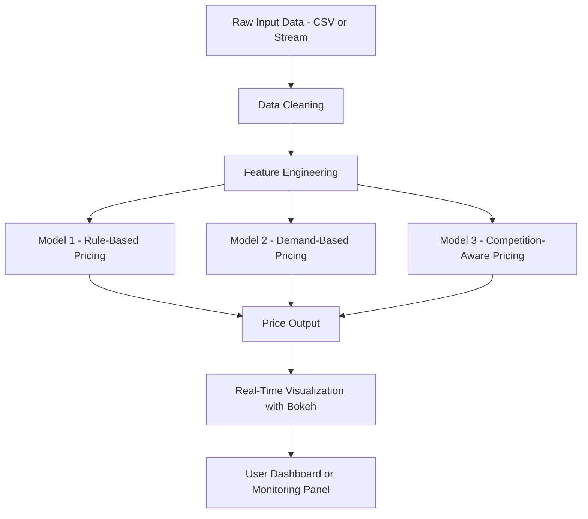

# capstoneproject

[Dynamic Pricing for Urban Parking Lots](./Dynamic_Pricing_for_Urban_ParkingLots.pdf)

---

## 🔧 Tech Stack

| Category                 | Tools / Libraries Used                                                               |
|--------------------------|--------------------------------------------------------------------------------------|
| **Programming Language** | Python 3                                                                             |
| **Data Manipulation**    | NumPy, Pandas                                                                        |
| **Visualization**        | Bokeh, Matplotlib, Panel, IPython.display                                           |
| **Streaming & Pipelines**| Pathway (real-time data streaming and transformation)                                |
| **Geospatial Analysis**  | scikit-learn (BallTree), geopy                                                       |
| **Notebook Environment** | Google Colab                                                                         |
| **Version Control**      | Git, GitHub                                                                          |
| **Miscellaneous**        | `time.sleep`, `random`, `datetime`                                                  |

---

## 🏗️ Architecture Diagram



---

## 🔄 Project Architecture & Workflow

This project simulates a real-time dynamic pricing system for 14 urban parking lots using a combination of economic logic, data engineering, and visualization techniques.

### 1. 🔹 Data Ingestion
- Raw data is loaded from a `.csv` file or simulated as a real-time stream.
- Each row includes timestamped info: Occupancy, Queue Length, Traffic, Special Day, Competitor Prices, Vehicle Type Weights.

### 2. 🧹 Data Cleaning & Preprocessing
- Missing values interpolated.
- Datetime column (`t`) created and sorted.

### 3. 🧠 Feature Engineering
- Proximity features using `BallTree`:
  - `distance_to_nearest_parking`
  - `num_parkings_within_500m`

### 4. 🤖 Pricing Models
#### Model 1: Rule-Based
- Uses thresholds on occupancy, traffic, queue length, etc.

#### Model 2: Demand-Based
\[
\text{Demand} = \alpha - \beta \cdot \text{Price} + \gamma \cdot (\text{Occupancy} + \text{Traffic})
\]

#### Model 3: Competition-Aware
- Adds competitor pricing impact to Model 2.

### 5. 🔄 Real-Time Simulation
- Pathway streams data row-by-row with `sleep()` delays.

### 6. 📊 Visualization
- Bokeh plots for price, competitor price, and demand.
- Controlled via Panel in Colab using `output_notebook()`.

### 7. 🚀 Deployment Possibilities
- Streamlit or Bokeh Server
- Smart parking meter integration
- Live traffic/occupancy APIs

---
```
## 📄 Final Report

You can view the complete project report here:

[📄 Click to view the Final Report (PDF)](./docs/Dynamic_Pricing_for_Urban_ParkingLots.pdf)

[Open test file](https://github.com/shambhavi1635/capstoneproject/blob/main/Dynamic_Pricing_for_Urban_ParkingLots.pdf)
```
